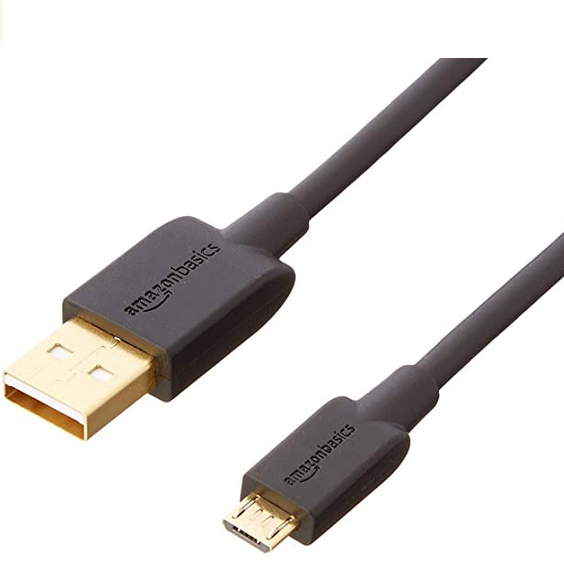

# Connecting The Raspberry Pi To The RoboHAT MM1

After plugging the RoboHAT MM1 into the Raspberry Pi GPIO header, using a 
a micro-USB to USB-A cable, plug the mini-USB connector into the RoboHAT MM1 and
the USB-A connector into any of the USB sockets on the Raspberry Pi.

 
 

Copyright (C) 2020 Alan Yorinks. All Rights Reserved.