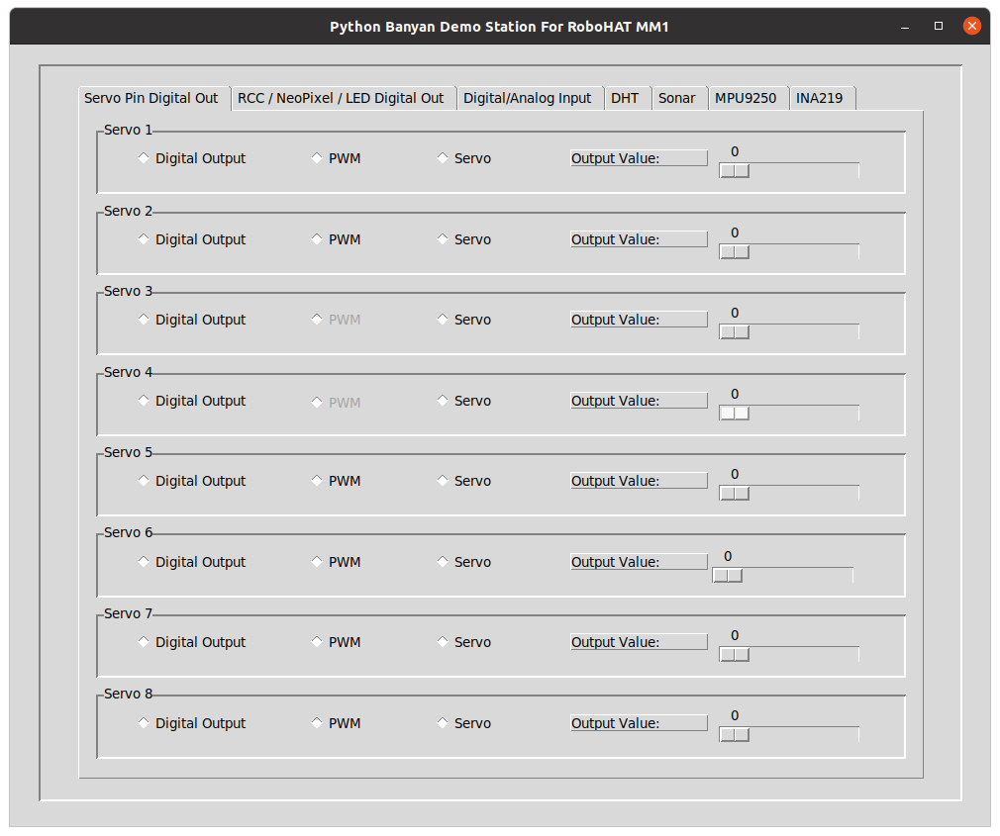

# The Tkinter Graphical User Interface Demo
 

## Starting The Demo
When you install pymata-rh, a graphical demo is automatically installed for you.
To start the demo, open a terminal and type:

rhdemo

 

The _rhdemo_ program is a [python-banyan](https://mryslab.github.io/python_banyan/)
 application. When you invoke rhdemo, a Banyan backplane, the GUI, and a Banyan Gateway for
  pymata_rh is automatically started for you.
  
This demo allows you to interact with the RoboHAT MM1 without having to do any programming.
All features are supported for all pins that support the feature.

## Ending The Demo
Press Control-C in the terminal window where you started rhdemo.

## Servo Pin Digital Out

 

You can set a Servo pin for digital output on this first screen and set the output 
value to a zero or a 
one by using the associated slider on the right side. Except for Servo 
pins 3 and 4, you can set the PWM output 
value between 0 and 255 for each pin.  Lastly, you can attach a servo to any 
of the pins and adjust the servo angle to between 0 and 180 degrees.

## RCC/NeoPixel/LED Out
 

This screen is very similar to the first screen but allows you to control digital output
for the RCC pins, the NeoPixel pin, and the Board LED. 

The RCC pins do not support PWM, the NeoPixel pin supports all
 modes, and the LED can only be turned on or off.

**NOTE:** Pytmata-rh does not support direct control of NeoPixel devices, it just uses that pin
as a standard digital pin.

  
## Digital/Analog Input
 

This screen allows you to view the current digital or analog input values for each supported 
pin. The values displayed are continually being updated in real-time.

## DHT
 
This screen allows you to monitor both the humidity and temperature reported by a DHT 11 or 
DHT 22 device. Before pressing the button to monitor the DHT, select its connected pin and device
type using the provided GUI widgets. 
 Shortly after pressing the button
to start DHT monitoring, continuously updated and displayed on the right.

## Sonar
 
This screen allows you to connect an HC-SR04 SONAR distance sensor to the selected trigger and 
echo pins. After pressing the button to start monitoring, the measured distance is 
continuously updated and displayed on the right.

## MPU9250
 

The RoboHAT MM1 includes an integrated MPU9250 that consists of an accelerometer, gyroscope,
magnetometer, and temperature sensor. After pressing the button to start monitoring, 
this screen continuously displays the various axes and the 
temperature.

## INA219
 
The RoboHAT MM1 includes an INA219 voltage/current/power monitoring device. Shortly after
pressing the button to start monitoring, this display
will provide an updated view of the various parameters the INA219 provides. For updates,
you must press the button.

 
 

Copyright (C) 2020 Alan Yorinks. All Rights Reserved.
